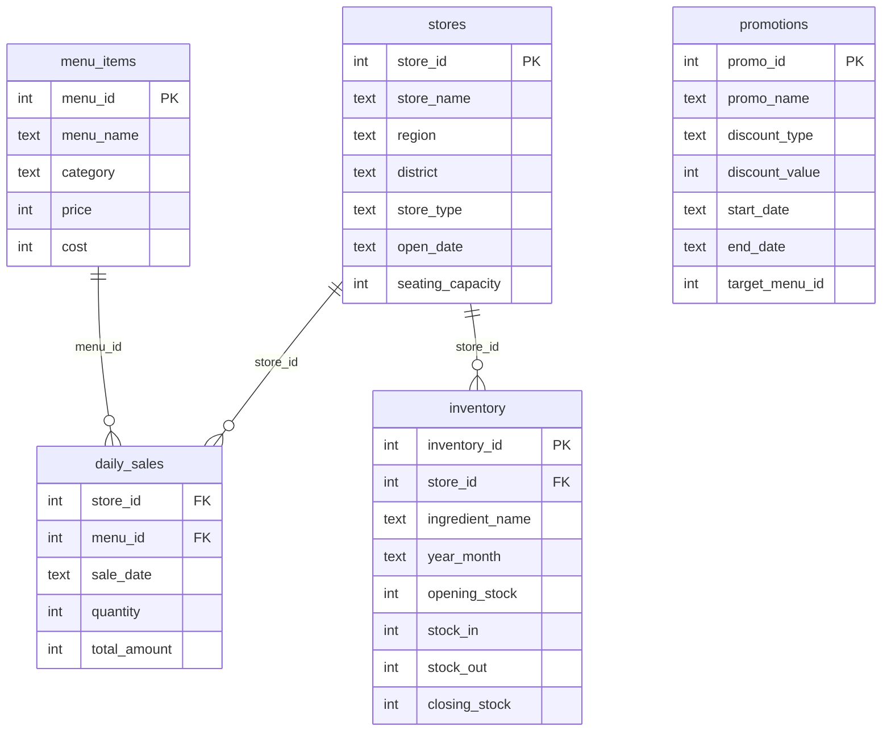

<div align="center">


</div>

<br>

## About

가상 프랜차이즈 브랜드 **맛나국밥**의 매출·재고·프로모션 데이터를 설계·생성하고,
단일 테이블 조회부터 윈도우 함수·VIEW 기반 데이터마트까지 SQL을 단계적으로 실습한 프로젝트.
서울시 공공 상권 데이터(추정매출 598K · 점포 2.1M · 유동인구 46K)를 병행 수집해 실데이터 분석 환경도 구축.

<br>

## DB Schema



<br>

## Query Examples

**월별 총매출 추이**
```sql
SELECT SUBSTR(sale_date, 1, 7) AS 월, SUM(total_amount) AS 총매출
FROM daily_sales
GROUP BY 월
ORDER BY 월;
```

| 월 | 총매출 |
|----|--------|
| 2025-01 | 1,009,678,000 |
| 2025-07 | 796,570,000 |
| 2025-12 | 1,005,456,000 |

> 겨울(1·12월) 성수기, 여름(7·8월) 비수기 패턴 확인

<br>

**매장별 매출 순위 (윈도우 함수)**
```sql
SELECT
    store_name,
    SUM(total_amount) AS 총매출,
    RANK() OVER (ORDER BY SUM(total_amount) DESC) AS 순위
FROM daily_sales
JOIN stores ON daily_sales.store_id = stores.store_id
GROUP BY store_name
ORDER BY 순위;
```

| store_name | 총매출 | 순위 |
|------------|--------|------|
| 맛나국밥 영등포구점 | 654,547,000 | 1 |
| 맛나국밥 용인시점 | 629,635,000 | 2 |
| 맛나국밥 성남시점 | 414,822,000 | 20 |

<br>

**VIEW 활용 — 직영점 필터링**
```sql
-- VIEW 생성
CREATE VIEW v_store_sales AS
SELECT region, store_type, store_name,
       SUM(total_amount) AS 총매출,
       RANK() OVER (ORDER BY SUM(total_amount) DESC) AS 순위
FROM daily_sales
JOIN stores ON daily_sales.store_id = stores.store_id
GROUP BY store_name, region, store_type;

-- VIEW 재사용
SELECT store_name, region, 총매출, 순위
FROM v_store_sales
WHERE store_type = '직영'
ORDER BY 순위;
```

| store_name | region | 총매출 | 순위 |
|------------|--------|--------|------|
| 맛나국밥 영등포구점 | 서울 | 654,547,000 | 1 |
| 맛나국밥 달서구점 | 대구 | 601,874,000 | 5 |
| 맛나국밥 강서구점 | 서울 | 589,305,000 | 6 |
| 맛나국밥 성남시점 | 경기 | 414,822,000 | 20 |

<br>

## Project Structure

```
sql-franchise-analysis/
├── scripts/
│   ├── generate_franchise_data.py   # 가상 프랜차이즈 데이터 생성 및 SQLite 적재
│   └── fetch_seoul_data.py          # 서울 열린데이터광장 API 수집
├── queries/
│   ├── phase2_basic_queries.sql     # SELECT / WHERE / JOIN / GROUP BY
│   ├── phase3_analysis_queries.sql  # HAVING / 서브쿼리 / 윈도우 함수
│   └── phase4_view_queries.sql      # VIEW / 데이터마트
├── notebooks/
│   ├── phase2_basic.ipynb
│   ├── phase3_analysis.ipynb
│   └── phase4_view.ipynb
└── data/                            # SQLite DB (gitignored)
    ├── franchise.db
    └── seoul_commercial.db
```

<br>

## Phase Summary

| Phase | 주제 | 주요 개념 |
|-------|------|-----------|
| **2** | 기본 쿼리 | `SELECT` `WHERE` `ORDER BY` · `GROUP BY` · 2–3 테이블 `JOIN` |
| **3** | 분석 쿼리 | `HAVING` · 서브쿼리 · 윈도우 함수 (`RANK`) |
| **4** | VIEW · 데이터마트 | `CREATE VIEW` · 집계 뷰 재사용 |

<br>

---

<div align="center">


</div>
